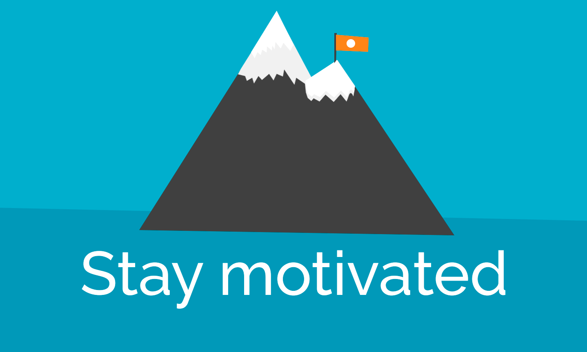

One of the things that I’ve realized with the passage of time is that <mark>no matter how good or talented you are at something, there are many things that you’ll only learn from experience</mark>, things you probably wish you knew before. In this article, I’m focusing on the things I consider to be most important after all these years as a software developer.

### It’s ok to make mistakes, just be careful, embrace them and learn from them

One of the things everybody is always worried about, is, of course, making mistakes, and with reason, mistakes can cost some companies a lot of money but we’re all humans and **mistakes WILL happen**, we’ll feel bad about them and we’ll want to slap ourselves in the face because, _How could we have missed that condition in the block?,_ _how could we have messed up the condition for the recursive call?_, _how did the code review and QA miss it?_, _how, how, HOW?_ (Echo continues), the answer to all these questions is very simple, again, **WE ARE ALL HUMANS.**

<mark>Learn from your mistakes but still allow yourself to make some</mark> because they’ll make you better, they’ll make you grow into a better professional/person so don’t punish yourself because of them, don’t waste time lamenting things that have already happened, instead, take the time to reflect on the things you could do to avoid this from happening the next time, raise your head and go on (Inspirational phrase of the day checked off my list).

### Stay motivated, have your own projects

One of the things that helps me stay motivated -apart from work- is that I know I can go home and keep working… “wait, WHAT? ARE YOU CRAZY…?_“_, I meant to say keep working **on my personal projects**_… “Ohh, gotcha…” ,_ Yes*,* these projects are based on ideas that I’m very passionate about and that are persistently helping me learn new things. Having personal projects is what indirectly opened the door to my first web developer job, it has also allowed me to meet great people around the globe. The cool part is that you can choose any stack or tech you want on your projects, which means you can use them to learn new tech at the same time you’re fulfilling your goals.

If you don’t currently have any ideas to work on, you can _collaborate with a friend or an open source project_**,** the main idea here is to keep you motivated out of work. To host my projects I usually use [Gitlab](https://gitlab.com/) and [Github](http://github.com/)

### Change should be the only constant, but it doesn’t always come by itself

As a developer, you are usually in constant movement, always adapting to new technologies, implementing new features, solving new problems and many other things, but, there are always moments at work when things get a little quiet and not many new things come up for you to work on (Like when you have to work in basic experiments or implement a series of trivial features, duh… a piece of cake for people like us, right?). When this happens it’s good to **have alternative plans**, plans that challenge our “massive” and “uncontrollable” intellect, for example:

-   Learn the documentation for a new technology.
-   Take courses online. (There are many platforms, if you want to learn tech and practice spanish at the same time, you can go to [somosprogramadores](http://somosprogramadores.com/))
-   Read a book.
-   Refactor that trashy code you always wanted to improve.
-   Learn a new programming paradigm or design pattern.

Be creative, there are many more things you could do here, <mark>the point is to push you out of your comfort zone.</mark>

### Push yourself but don’t bloat your brain

As developers, we’re a species that is always working until late hours trying to figure out “that problem”, we’re the backup they know they can rely on for unexpected hotfixes at 10pm-11pm, We offer our help even when we are full of work and go to sleep at 5 am because we really enjoy helping (ok maybe I’m exaggerating a little), we work very hard because we need to have our products working _flawlessly_ 24/7 every single day of the year, some people see the things I mentioned before as bad things because there is too much stress involved, others think of them as good leadership qualifications, it doesn’t really matter what other people think, what matters is that we love what we’re doing and that we are doing our best.

With all these being said**, there is definitely one thing you should pay attention to** and that is when your brain yells at you with a dying voice _TAKE A BREAK_(YES, even if you don’t want to), why?, because nobody can work that hard without eventually getting sick or something worst _TRUST ME_**,** <mark>The best you can do is take some time off and rest</mark>. Nobody is going to think that you’re lazy because you’re taking a week off and even if someone does, you shouldn’t care about it because you work hard, you kick ass and you always do your best.

### Care about your coworkers and help them grow

If you have a couple of years of experience you know this already, pairing and helping others is a great way of learning and improving the confidence inside your team, it helps people understand that they’re not a burden and that needing help is not a bad thing (IT NEVER IS), if you do this, many things will improve in your work environment, the communication lines will be smoother, people will trust you and in result you’ll have many more positive days at your job.

Show respect for your coworkers, care when someone gets sick, it’s ok to differ from your teammate’s points of view as long as you respect their position, don’t be afraid to be the way you’re (I could swear I heard that last phrase in a song) and most importantly enjoy the journey you’re on.

I hope you could identify yourself with at least one of the points in this article, if you have any comments or extra information to add you can do it in the comments section below.
