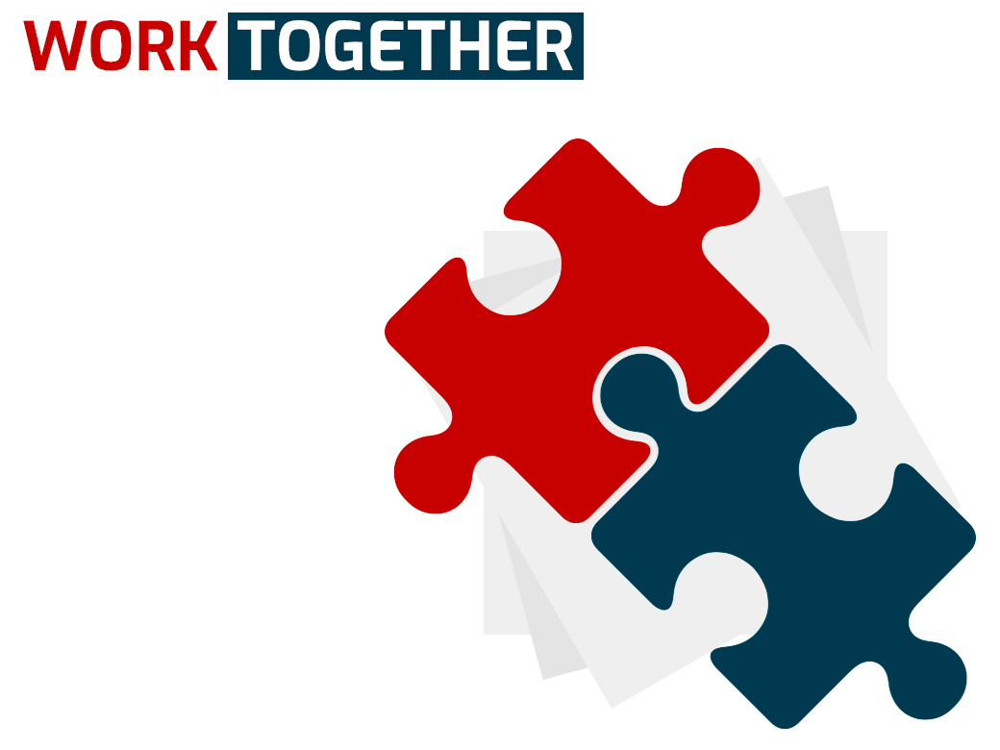

As developers we're people that are constantly looking forward to optimizing code, write the best, most performant, readable algorithms possible in order to have a clean codebase that's understandable and scalable, we don't always succeed on this task in the first attempt but we constantly evolve and learn in order to get to a good consistent spot where we can feel comfortable, however, being a software developer is _far more complex_ than just writing code and optimizing algorithms, sometimes it can be overwhelming, not everything we do is inside a code editor and in this article I'm going to be talking a little about these _outside of the code_ experiences and about how we can get better integrally as professionals and approach situations in our job environments that are not solved with an algorithm.

### Have a very good idea? don't force it into the team, lead by example and explain it with actions

Constantly we find ourselves looking for things to improve and because of our previous experiences we have a lot of potential to help and avoid making mistakes that we or our teams made in the past, this is excellent, you start proposing ideas and sharing them with the right people, but there are times when no one really listens and since you're not the manager you don't really have the power to make those ideas turn into reality in an easy way, what do we do if we're not being listened to?

#### Lead by example

Don't try to push/force your ideas into the team, instead, show with your actions what your words didn't get to show, be consistent and don't force anybody else to do things your way, I.e if your idea is an improvement in the workflow, show it in your daily work by applying it but without bragging about it, then at a later point somebody will ask you about why you do things that way, and that's the right moment to explain, if you don't get asked about it, then you can take this step and talk to your manager and explain what you have been doing and show with results why it's a good idea, often (most of the time) the best way to show that something works is to have _demonstrable results_, you can even prepare a presentation or some set up that helps to explain your ideas with facts.

### Understand that your ideas will not always be the best ones, be prepared to answer questions, embrace errors and new perspectives without shame

**Picture this scenario:**
There is this great new feature that the team has to implement, you're in the middle of a brainstorming session and you got this amazing idea of how to implement it,
the first thing you have to do is ask yourself questions about it and found downfalls, then, when you feel ready you raise your hand and start talking and explaining it, people will start to agree with you and when you think your idea is going to be the chosen one there comes this other great developer and asks a complex question that you know makes sense but you didn't think about before so you don't know the answer, _THIS WILL HAPPEN_, you realize that your idea might not be the correct one after all but you were so close that you don't want to give up, there are two things you can do:

#### 1. Answer back and hope for the other developer to agree with you just because he doesn't want to argue.

This is bad for so many reasons... First of all, remember that the people you work with are not dumb, they will notice when you're not right, but some of them will be kind enough like to stay in silence and don't say anything. Others will argue back and you'll have to answer more complex questions, one complex question at the time, you can keep pretending, and finally, you'll see that people get tired and don't ask anymore, you think you did good? you think you've won?

no...!

You've only created an unhealthy environment between you and your coworkers where they now have trust issues about you, they will no longer want to have debates, suggest ideas, or even ask questions just because you were too arrogant to accept that your proposal wasn't perfect and that it needed a little of help.

#### 2. Be honest, say that you don't know but make clear that you're open to ideas and willing to learn

This is the best thing you can do, if you get asked a question to which you don't know the answer **just be honest and let people help**, you'll build a better solution together solving one problem at the time, you'll get help from your teammates and if someone wants to look like the clever developer making you look like you don't know anything, you'll get the support of your team, be honest and humble _always_ because you now know that there are more important things.

There is really nothing else to say here, being honest about not knowing is the most healthy thing you can do, everybody knows you're not perfect, every time you decide to admit that you don't know something instead of lying shows that you're someone to trust and that you won't lie to defend yourself making you an unreliable person.

### Communicate early to avoid fixing later

If you're working on a task and you realize that there is a decision that you can't make alone (maybe a product/business decision) don't give the answer for granted and definetly **DO NOT WAIT UNTIL THE LAST MOMENT TO ASK**, do it before you even start to work on your task or in the moment you found out about the issue, time is precious, if you ask early you are:

1. Giving more time to solve possible unexpected issues.
2. Giving away responsibility to the right people.
3. Raising awareness about the development time being potentially affected and helping your team relocate work and time in advance.
4. Avoiding a possible technical patch or refactor.

### Avoid miss-understandings have a source of truth for your tasks and work

This is something very simple and yet so important, keeping a trackable source of truth to rely on when working in your implementations is essential and it's useful not only for you as a developer but also for product management and the company, this will help you have all the interested parts aligned with the current goals and make sure that the work being done is the one specified, also this will avoid miss-understandings if one of the parts asks for something that wasn't originally captured in the ticket.

**Be always kind, respectful, open to receive help and willing to help others!**

Do you have any experiences or advice you'd like to share? you can share it on twitter!

Ok devs that are reading this from the future, I think that's it for now. If you enjoyed the article be sure to leave a comment and share it with your friends/coworkers... remember that you can find me on twitter [@duranenmanuel](https://twitter.com/duranenmanuel) or just write me an email at <duranenmanuel@gmail.com>.
